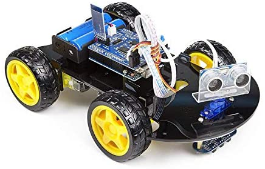

# obstacle-detector-robot
Obstacle Detector Robot
It is a project aiming to detect risk on a road by detecting obstacles.
We are using a mobile Rover robot for the purpose of the prototype.

## Principle Objectives
Below you will find the principle objectives, a summary of the results, and discussion.

# Objectives
1. Correctly identify risk on a road by detecting obstacles when the car is moving.

2. Process the risk to take a decision according to the proximity of the risk.

3. Alert the driver using a sound alert associated with an appropriate lightening system, ones achieved objectives _1_ and _2_.

4. Brake the car and stop it for the purpose of the prototype.

## Preview of the system

  

Copyright, All right reserved. by Romaric Tsopnang.
